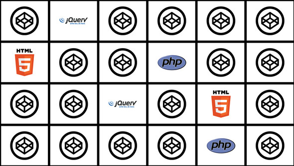

# [JS review](Review/Readme.md)

## REVIEW_CHAPTER_01

### [_[003]_](Chapter_01/003_ABC_of_programming/Readme.md) ABC OF ROGRAMMING:

**_To write a script, you need first to state your goal and then list the tasks that need to be completed in order to achieve it. Start with the big picture of what you want to achieve, and break that down into small steps._**

> Note that programming is not about the language and it's syntax, but more about being creative and how to do things. Most of fresh beginner programmers, start coding without planning including me at early stages.

Let us write the steps needed for this simple `memory-game`



So from what we see ... we can break down the issue into small peaces:

1. `The game depends on even pairs, if we make it 4*6 then we need 12 images (4*6)/2.`
2. `Create an array for images to store url inside. Array of 12 indexes.`
3. `Double those 12 images to make pairs.`
4. `Create array of 2 places which will store your two moves. The values of this array is the id of the card position.`
5. `Create a counter variable for how many moves has been made.`
6. `Make a function called "shuffleImages()" that shuffling images by take argument and return shuffled array of images.`
7. `Create function called "render()" to print the cards in html.`
8. `If player click on card, then show the hidden image or (Flip the card).`
9. `Create a function called "checkMoves()" to check if the player has flipped the right pairs. If yes then set data flag in HTML that those cards has been exposed which means no action applies on them anymore.`
10. `Create a button for resetting the game.`
11. `You may need more variables as needed in the app.`

> :bulb::bulb::bulb:IMPORTANT TO KNOW: That might be not the perfect steps in your perspective, but those steps are good enough to start your code. Sometimes along the way you figure some point missing, in this case return back to your steps and add them with repeating overview to the rest in order to check if those additional steps are matching with others without conflicting.

After spending your passion on this game, you should get something like this:

`Memoty Game` <a target="_blank" href="Review/Examples/memory-game/dist/index.html">**Review/Examples/memory-game/dist/index.html**</a>

> Note that the code is not for you to read. If you want to read the original code without webpack extra additions then go tho this directory `Review/Examples/memory-game/src/index.html`

> Webpack is used to ease the development environment, it is monster tool that has a huge reputation among developers and big companies are using it like Google, Facebook.

### [_[004]_](Chapter_01/004_How_do_computer_understand_real_world/Readme.md) HOW COMPUTER UNDERSTAND REAL WORLD:

**_Always remember that the main 3 pillar of representing real world objects are [properties, events, methods]. Computers can make complicated relations between complex objects and this is how applications getting bigger and smarter_**

Imagine you have system for controlling attending participant, the object for each participant might be like the following:

```js
var participant = {
  firstName: "John",
  lastName: "Wick",
  age: 26,
  attendedClass: "JavaScript",
  attendedAt: "06.07.2019 14:32:01",
  updateAttendanceTime: newTime => {
    this.attendedAt = newTime;
    return "Attendace time updated.";
  }
};
```

_DO YOU THING "updateAttendanceTime" METHOD WILL WORK ?_

### [_[005]_](Chapter_01/005_How_do_I_write_script_for_a_web_page/Readme.md) HOW DO I WRITE SCRIPT FOR A WEB PAGE

**_There is also main pillar for web pages which are [HTML, CSS, JavaScript] which can be combined to produce webpages_**

Let us do the layout for the `memory game` with very basic HTML, CSS, JAVASCRIPT.
This example found in <a target="_blank" href="Review/Examples/memory-game/dist/index.html">**Review/Examples/memory-game/dist/index.html**</a>

**HTML**

```html
<!DOCTYPE html>
<html lang="en">
  <head>
    <script src="./js/index.js"></script>
    <meta charset="UTF-8" />
    <meta name="viewport" content="width=device-width, initial-scale=1.0" />
    <meta http-equiv="X-UA-Compatible" content="ie=edge" />
    <title>Memory-Game</title>
    <link rel="stylesheet" href="./css/style.css" />
  </head>
  <body>
    <div class="memory-game">
      <div class="control-container">
        <button id="restart" onclick="restart()">
          Restart
        </button>
        <h2 id="moves">POINTS: <span>0</span></h2>
      </div>
      <div class="header">
        
      </div>
    </div>
  </body>
</html>
<!-- Is script position right ? -->
```

**CSS**

```css
html,
body {
  height: 100%;
  background: #333;
}

.memory-game {
  width: 80%;
  margin: 0 auto;
  text-align: center;
}
.control-container {
  display: flex;
  justify-content: center;
  align-items: center;
}
.control-container #restart {
  padding: 10px 15px;
  border: 0;
  border-radius: 3px;
  background: burlywood;
  margin-right: 32px;
  color: white;
  font-weight: bold;
  font-size: 28px;
  transition-property: padding, box-shadow;
  transition-duration: 0.3s;
  transition-timing-function: ease-in-out;
}
.control-container #restart:hover {
  padding: 15px 20px;
  box-shadow: 0 0 30px 5px darkred;
}

.control-container #moves {
  color: white;
}
```

**JavaScript**

```js
(function() {
  let memoryGameContainer = document.getElementById("moves");
  console.log(memoryGameContainer);
})();
```
