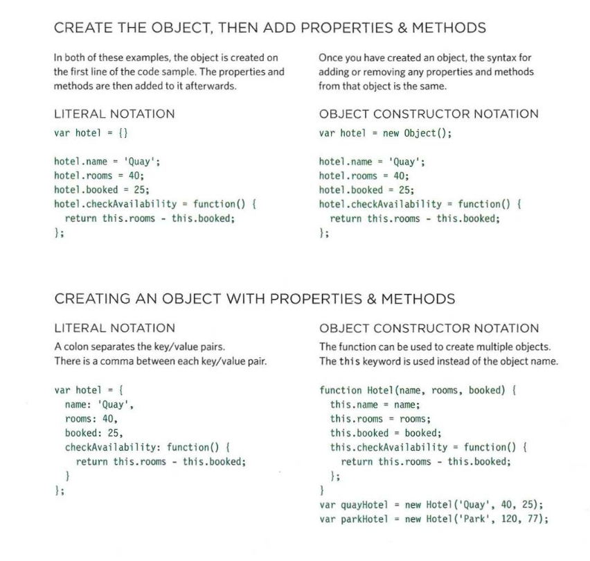
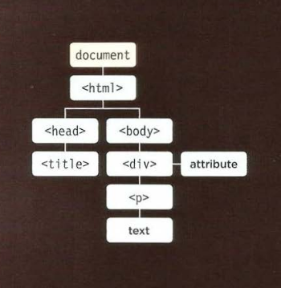
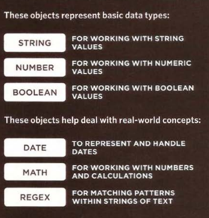
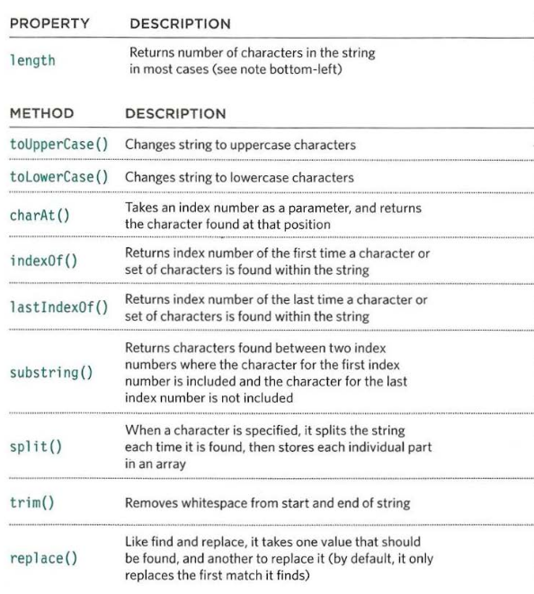
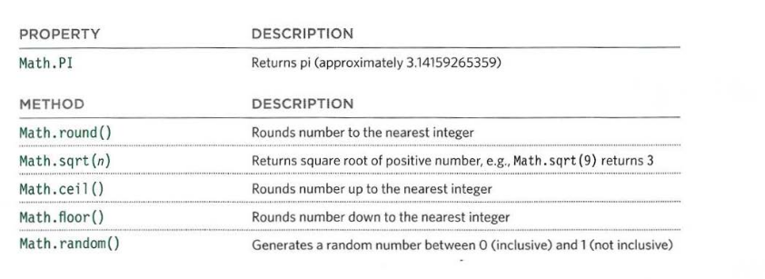
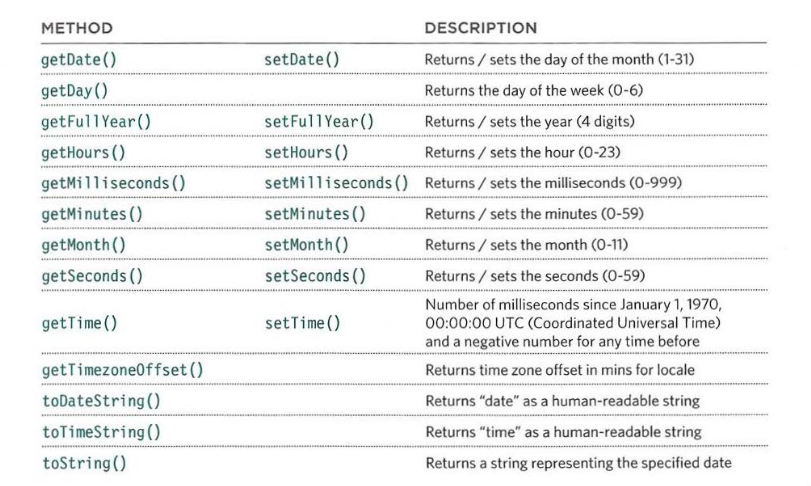

# [JS review](Review/Readme.md)

## FUNCTION, METHODS AND OBJECTS

### [_[011]_](Chapter_03/011_Functions/Readme.md) WHAT IS A FUNCTION:

Functions let you group a series of statements together to perform a specific task. If different parts of a script repeat the same task, you can reuse the function (rather than repeating the same set of statements).

#### Function declaration:

**Rule(ES5): function manditoryname ( Optionalvariables ) { //your code }**

#### Calling a function:

**manditoryname()**

#### Declaring a function that needs information:

```js
function getArea(width, height) {
  return width * height;
}

let footballDimension = [90, 120]; // in meter
// To call that function and information for process:
let area = getArea(footballDimension[0], footballDimension[1]); // As you see we assign the function to a variable because that function is returning value that can be used in other places.
```

> The return of the function is `single value`.

> If your return is `multiple values` then you can return `array` or `object` to aggregate your values in.

#### Anonymous functions & function expressions

- Function declaration:

  ```js
  function getArea(width, height) {
    return width * height;
  }
  ```

- Function expression:

  ```js
  let getArea = function(width, height) {
    return width * height;
  };
  ```

### [_[012]_](Chapter_03/012_IIFE_and_scoping/Readme.md) IMMEDIATELY INVOKED FUNCTION EXPRESSIONS:

This way of writing a function is used in several different situations. Often functions are used to ensure that the variable names do not conflict with each other (especially if the page uses more than one script).

```js
(function getArea(width, height) {
  return width * height;
})();
```

#### When to use it ?

1. Prevent variable naming conflicts.
2. Execute specific configuration for your system.

#### Function Scopes:

- Global scope:
- Private scope:

```js
let PI = 3.14; // Global scope with global variable.
function getCircleArea(radius) {
  let squareRadius = Math.pow(5, 2); // Private scope with private variable.
  return squareRadius * PI;
}
let circleArea = getCircleArea(10);
```

### [_[013]_](Chapter_03/013_Objects/Readme.md) WHAT IS OBJECTS:

Objects group together a set of variables and functions to create a model of a something you would recognize from the real world. In an object, variables and functions take on new names.

Object is a combination of:

- Keys:
- Values:

```js
let course = {
  name: "JavaScript",
  isBoring: false, // Unless you have different opinion
  students: ["Abrar", "Rasha", "Duaa", "Alaa", "Saeid", "Hisham"],
  instructor: "The crazy guy who tries to be cleaver",
  studentCount: function() {
    return this.students.length;
  }
};
```

#### Accessing an object:

Using:

- `Dot notation`

```js
console.log(course.studentCount()); // 6;
```

- `Square Brackets`:

```js
console.log(course["studentCount"]()); // 6;
```

#### Creating many objects:

Using:

- `Constructor notation.`

```js
let obj = new Object();
obj.name = "Constructor notation";
```

- `Short hand.`

```js
let obj = {};
obj.name = "Short hand";
```

#### Updating an object

Using:

- `Dot notation.`

```js
let obj = {};
obj.name = "Short hand";
```

- `Square brackets.`

```js
let obj = {};
obj["name"] = "Short hand";
```

### Creating many objects:

```js
function Course(name, students, instructor) {
  (this.name = name),
    (this.students = students),
    (this.instructor = instructor),
    (this.studentCount = function() {
      return this.students.length;
    });
}

let students = ["Abrar", "Rasha", "Duaa", "Alaa", "Saeid", "Hisham"];
let instructor = "The crazy guy who tries to be cleaver";
let jsCourse = new Course("JavaScript", students, instructor);
let javaCourse = new Course(
  "Java",
  ["Abrar", "Rasha", "Duaa", "Alaa"],
  "Mohammed"
);
```

#### Array are objects!!!

> **_`===> Everything in javascript is object <===`_**



### [_[014]_](Chapter_03/014_This_keyword/Readme.md) "This" keyword:

> By default `this` is referring to `window`.

> ES5 `Functions is altering`this` keyword reference.

> ES6 `Fat arrow function` dose NOT alter `this` keyword reference.

There are:

- `Global context.`

```js
var a = 15; // Important to define it with var keyword. `Let` will not creating the variable in `window` object
console.log(this.a);
// => 15
console.log(window.a);
// => 15
```

- `Function context.`

Example-1:

```js
var a = 20;

function gx() {
  return this;
}

function fx() {
  return this.a;
}

function fy() {
  return window.a;
}

console.log(gx() === window); // => True
console.log(fx()); // => 20
console.log(fy()); // => 20
```

> IMPORTANT: We are comparing with memory reference and not with object keys and values. This is something you should not forget.

Example-2

```js
var o = {
  prop: 37,
  f: function() {
    return this.prop;
  }
};

console.log(o.f()); // => 37
```

Example-3

```js
function fx() {
  return this;
}

var obj = {
  method: function() {
    return this;
  }
};

var x_obj = {
  y_obj: {
    method: function() {
      return this;
    }
  }
};

console.log(fx() === window); // => True
console.log(obj.method() === window); // => False
console.log(obj.method() === obj); // => True
console.log(x_obj.y_obj.method() === x_obj); // => False
```

Examples-4

```js
function f2() {
  "use strict";
  return this;
}

console.log(f2() === undefined); // => True
```

### [_[015]_](Chapter_03/015_Array_in_objects_and_objects_in_array/Readme.md) Array of objects & Objects in array:

- Array in object:

```js
let costs = {
  room1: {
    items: [420, 40, 10]
  },
  room2: {
    items: [460, 20, 20]
  },
  room3: {
    items: [230, 0, 0]
  },
  room4: {
    items: [620, 150, 60]
  }
};
```

- Objects in array:

```js
let costs = [
  { accommodation: 420, food: 40, phone: 10 },
  { accommodation: 460, food: 20, phone: 20 },
  { accommodation: 230, food: 0, phone: 0 },
  { accommodation: 620, food: 150, phone: 60 }
];
```

### [_[016]_](Chapter_03/016_Browser_built_in_objects/Readme.md) Three groups of built-in objects:

Three types of built in objects:

1. BOM.
2. DOM.
3. Global javascript objects.

4. BOM:


2. DOM:



3. Global objects:



### [_[017]_](Chapter_03/017_String_global_object/Readme.md) String global objects (Built in object):

String object most important methods:



Example for applying those methods on string:


### [_[018]_](Chapter_03/018_Data_types/Readme.md) Data types:

We have two types:

1. Primitive.
2. Complex or aggregation type.

| Key       | Value type                |
| --------- | ------------------------- |
| String    | "JavaScript is awesome!!" |
| Number    | 1,2,2.5,...               |
| Boolean   | true, false               |
| Undefined | Undefined                 |
| Null      | null                      |
| Object    | {}                        |

### [_[019]_](Chapter_03/019_Number_global_object/Readme.md) Number global object:


### [_[020]_](Chapter_03/020_Math_object_and_date_object/Readme.md) Math object:



### [_[020]_](Chapter_03/020_Math_object_and_date_object/Readme?id=date-object) Date object:



