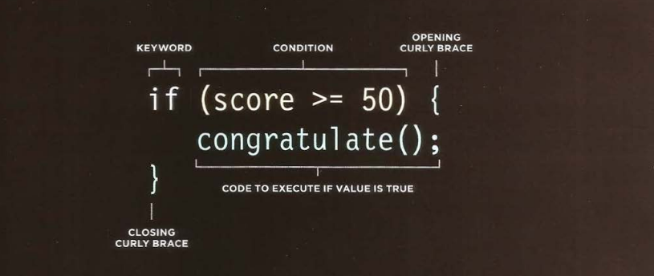

# [JS review](Review/Readme.md)

## DECISIONS AND LOOPS

### [_[022]_](Chapter_04/022_decisions_and_loops/Readme.md) DECISION AND LOOPS:


```js
if (score > 50) {
  // Expression to evaluate
  alert("You passed!"); // Conditional statement to be done when condition is passed
} else {
  alert("Try again..."); // Conditional statement to be done when condition is failed.
}
```

#### COMPARISON OPERATORS

| Comparison operator | Meaning                        | Example |
| ------------------- | ------------------------------ | ------- |
| ==                  | **_Is Equal_**                 |         |
| !=                  | **_Is Not Equal_**             |         |
| ===                 | **_Strickt Equal To_**         |         |
| !==                 | **_Strickt Not Equal To_**     |         |
| >                   | **_Greater Than_**             |         |
| <                   | **_Less Than_**                |         |
| >=                  | **_Greater Than Ot Equal To_** |         |
| <=                  | **_Less Than Or Equal To_**    |         |

#### USING EXPRESSIONS WITH COMPARISON OPERATORS


#### LOGICAL OPERATORS

| Comparison operator | Meaning           | Example               | Result |
| ------------------- | ----------------- | --------------------- | ------ |
| &&                  | **_Logical And_** | ((2 < 5) && (3 >= 2)) | true   |
| \|\|                | **_Logical Or_**  | ((2 < 5) && (2 < 1))  | true   |
| !                   | **_Logical Not_** | !(2 < 1)              | false  |

#### UNDERSTANDING LOGICAL AND (&&)

| Operand 1 | Logical operation | Operand 2 | Result  |
| --------- | ----------------- | --------- | ------- |
| false     | &&                | false     | `false` |
| false     | &&                | true      | `false` |
| true      | &&                | false     | `false` |
| true      | &&                | true      | `true`  |

#### UNDERSTANDING LOGICAL OR (||)

| Operand 1 | Logical operation | Operand 2 | Result  |
| --------- | ----------------- | --------- | ------- |
| false     | \|\|              | false     | `false` |
| false     | \|\|              | true      | `true`  |
| true      | \|\|              | false     | `true`  |
| true      | \|\|              | true      | `true`  |

#### UNDERSTANDING LOGICAL NOT (!)

| Logical operation | Operand 1 | Result  |
| ----------------- | --------- | ------- |
| !                 | false     | `true`  |
| !                 | true      | `false` |

### [_[023]_](Chapter_04/023_If_statements_and_if_else/Readme.md) IF AND IF...ELSE STATEMENT:



#### IF...ELSE STATMENT


### [_[024]_](Chapter_04/024_Switch_statment/Readme.md) SWITCH STATEMENT:

```js
switch (level) {
    case 'One':
        title = 'Level 1'
        break;
    case 'Two':
        title = 'Level 2'
        break;
    case 'Three':
        title = 'Level 3'
        break;
    default '':
        title = 'Test'
}
```

#### WHICH TO USE (IF..ELSE) OR (SWITCH)

| if...else                                                                                                                         | switch                                                                                                 |
| --------------------------------------------------------------------------------------------------------------------------------- | ------------------------------------------------------------------------------------------------------ |
| 1- There is not need to provide an else option. (You can just use an if statement)                                                | You have a `default` option that is run if none of the cases match.                                    |
| 2- Witch a series of `if` statements, they are all checked even if a match has been found (so it performs more slowly than witch) | If match is found, that code is run. Then the break statement stops the rest of the `switch` statement | running (providing better performance than multiple if statement) |

#### [_[025]_](Chapter_04/025_Truthy_and_falsy/Readme.md) WHICH TO USE (IF..ELSE) OR (SWITCH):

##### FALSY TABLE

| Value         | Description                             |
| ------------- | --------------------------------------- |
| false         | The traditional Boolean false           |
| 0             | The number zero                         |
| ''            | Empty string                            |
| 10/'score'    | NaN (Not a Number)                      |
| var highScore | A variable with no value assigned to it |

##### Truthy table

| Value     | Description                  |
| --------- | ---------------------------- |
| true      | The traditional Boolean true |
| 1         | Numbers other than zero      |
| 'correct' | String with content          |
| 10/5      | Number calculation           |
| 'true'    | True written in string       |
| '0'       | Zero written as a string     |
| 'false'   | false written as a string    |

##### CHECKING EQUALITY & EXISTENCE

1. Level 1

| Expression     | Result |
| -------------- | ------ |
| (false == 0)   | true   |
| (false === 0)  | false  |
| ------         | -----  |
| (false == '')  | true   |
| (false === '') | false  |
| ----           | ------ |
| (0 == '')      | true   |
| (0 === '')     | false  |

2. Level 2

| Expression           | Result |
| -------------------- | ------ |
| (undefined == null)  | true   |
| (undefined === null) | false  |
| ------               | -----  |
| (null == false)      | false  |
| (undefined == false) | false  |
| (null == 0)          | false  |
| (undefined == 0)     | false  |
| ----                 | ------ |
| (undefined === null) | false  |

3. Level 3

| Expression    | Result |
| ------------- | ------ |
| (NaN == null) | false  |
| (NaN == NaN)  | false  |
| (NaN === NaN) | false  |

#### SHORT CIRCUIT VALUES

| Expression                      | Result    |
| ------------------------------- | --------- |
| var a = ('john' \|\| 'Unknown') | 'john'    |
| var b = ('' \|\| 'Unknown')     | 'Unknown' |
| var c = ('' \|\| {})            | {}        |
| var c = (0 \|\| 1 \|\| 2)       | 1         |

#### [_[026]_](Chapter_04/026_Loops/Readme.md) LOOPS:
