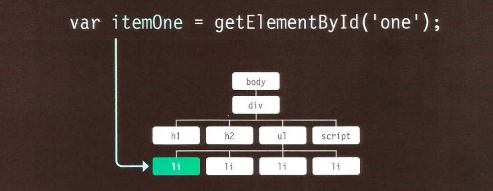
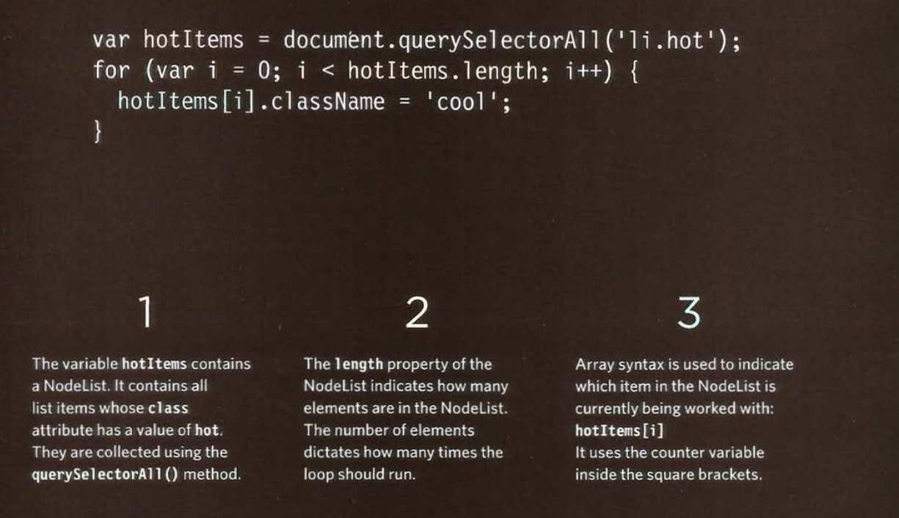
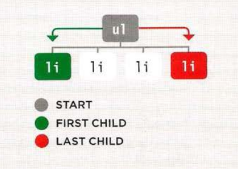
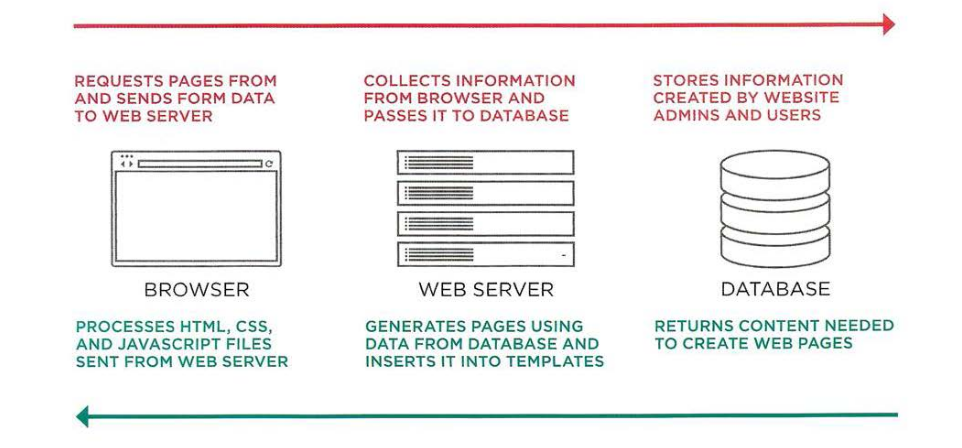
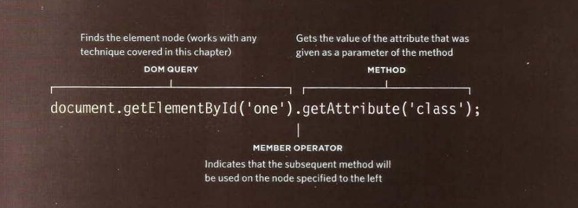
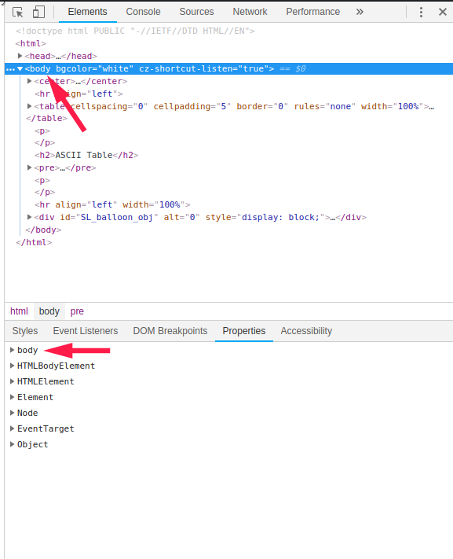

# [JS review](Review/Readme.md)

## DOCUMENT OBJECT MODEL (DOM)

### [_[028]_](Chapter_05/028_DOM_Tree_web_page_model/Readme.md) DOM TREE WEB PAGE MODEL:

Four types of nodes:

1. `Document node`
2. `Element node`
3. `Attribute node`
4. `Text node`

#### Working with the DOM tree (IN GENERAL):

A- Locate the node that represents the element you want to work with.
B- Use its text content, child elements, and attributes.

#### A- Accessing The Element:

- By selecting an individual element.
- By selecting multiple elements (Nodelists)
- Traversing between element nodes.

| Selecting individual element            | Selecting multiple element             | Traversing between elements     |
| --------------------------------------- | -------------------------------------- | ------------------------------- |
|  |             |  |
| `getElementById('ID_NAME')`             | `getElementsByClassName('CLASS_NAME')` | `parentNode`                    |
| `querySelector('CSS_SELECTOR')`         | `getElementsByTagName(HTML_TAG_NAME')` | `previousSibling / nextSibling` |
|                                         | `querySelectorAll('CSS_SELECTOR')`     | `firstChild / lastChild`        |

### B. Working with those Elements:

| Access / Update text nodes                                                        | Work with HTML content                       | Access / Update attribute values   |
| --------------------------------------------------------------------------------- | -------------------------------------------- | ---------------------------------- |
|                                                |           |       |
| 1. Select the \<li> element.                                                      | `innerHTML` Working with HTML inner elements | `ELEMENT.className` / `ELEMENT.id` |
| 2. Use the `firstChild` property to get the text node                             | `textContent` Only with text content         |                                    |
| 3. Use the text node's only property `nodeValue` to get the text from the element |                                              |                                    |

#### Caching DOM queries



### [_[029]_](Chapter_05/029_Accessing_elements/Readme.md) ACCESSING ELEMENTS:


#### NODELISTS: Dom queries that return more than one element:

1. When a DOM query returns a Nodelist, you may want to:

   - Select one element from the NodeList.
   - Loop through each item in the Nodelist and perform the same statements on each of the element nodes.

2. Like any other object, a Nodelist has properties and methods, notably:
   - The `length` property tells you how many it items are in the Nodelist.
   - The `item()` method returns a specific node from the Nodelist when you tell it the index number of the item t hat you want (in the parentheses).

#### Selecting an element from Nodelist

There are two ways to select element from NodeList:

1. Using `item()` method
2. Array syntax.

Then you can work on that specific node using properties and methods are related to the DOM element node.

### [_[030]_](Chapter_05/030_Repeating_actions_for_an_entire_nodelist/Readme.md) REPEATING ACTIONS FOR AN ENTIRE NODELIST:



### [_[031]_](Chapter_05/031_Traversubg_the_dom/Readme.md) TRAVERSING THE DOM:

- `parentNode` to get the container element.
- `previousSibling`, `nextSibling` to get previous or next element of according to the current element.
- `firstChild`, `lastChild` to get the first or last element inside the container of elements.


#### Apply previous & next sibling script


#### Apply first & last child script



### [_[032]_](Chapter_05/032_get_update_element_content/Readme.md) HOW TO GET/UPDATE ELEMENT CONTENT:

- `textContent` no effected by CSS.
- `innerText` effected by CSS.

### [_[034]_](Chapter_05/033_Adding_removing_html_content/Readme.md) ADDING OR REMOVING HTML CONTENT:

- `innerHTML` not secure but fast.
- `DOM manipulation` secure but not fast.

#### Removing HTML element via DOM manipulation:

Removing will go through three steps:

1. Store the element that you want to remove in a variable (By the same way of selecting elements).
2. Store the parent of that element in a variable.
3. Remove the element that you have stored in the first step with the following `removeChild(STORED_ELEMENT_THAT_YOU_WANT_TO_REMOVE)` method.

```js
// Store the element to be removed in a variable.
var removeEl = document.getElementsByTagName("li")[3];

// Find the element which contains the element to be removed.
var containerEl = document.getElementsByTagName("ul")[0];

// Remove the element.
containerEl.removeChild(removeEl);
```

### [_[035]_](Chapter_05/034_Cross_site_scripting_XSS/Readme.md) CROSS SITE SCRIPTING ATTACKS (XSS):

#### Cross site scripting attacks (XSS)

```html

```

#### Defending aginst Cross-Site Scripting attack:



1. Only let visitors input the kind of characters they need when supply information. This is known as `validation`. Do not allow untrusted users to submit HTML markup or JavaScript (As Front-End part).
2. Double-check validation on the server before storing it in database. This is important because user can bypass validation in the front-end.
3. Database may safely take XSS code script. This is because database is not processing the code but more that storing it only.

**Escaping data coming from the server & database**

4. As your data leaves the database, all potentially dangerous characters should be escaped.
5. Make sure that you are only inserting content generated by the users into certain parts of the template file.
6. Do not create DOM fragments containing HTML from untrusted sources. It should be added as text once it has been escaped.

### [_[036]_](Chapter_05/035_working_with_attribute_nodes/Readme.md) WORKING WITH ATTRIBUTE NODES:



| Method              | Description                                      |
| ------------------- | ------------------------------------------------ |
| `getAttribute()`    | Get the value if an attribute                    |
| `hasAttribute()`    | Checks if element node has a specified attribute |
| `setAttribute()`    | Sets the value if an attribute                   |
| `removeAttribute()` | Removes an attribute from an element node        |

| Property    | Description                               |
| ----------- | ----------------------------------------- |
| `className` | Gets the value of the **class** attribute |
| `id`        | Gets the value of the **id** attribute    |
| etc..       |                                           |

### [_[036]_](Chapter_05/036_examining_the_dom_in_chrome/Readme.md) EXAMINING THE DOM IN CHROME




